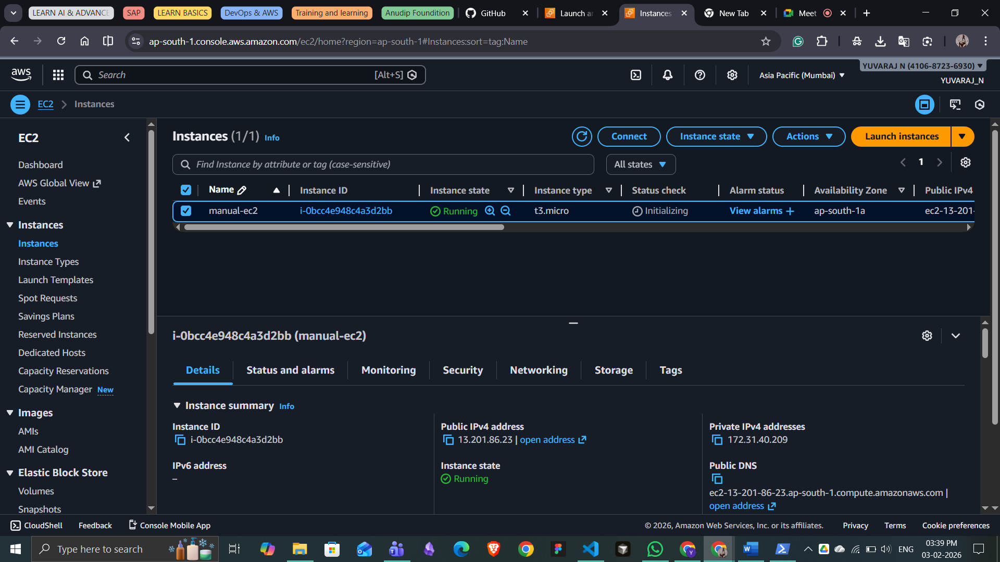
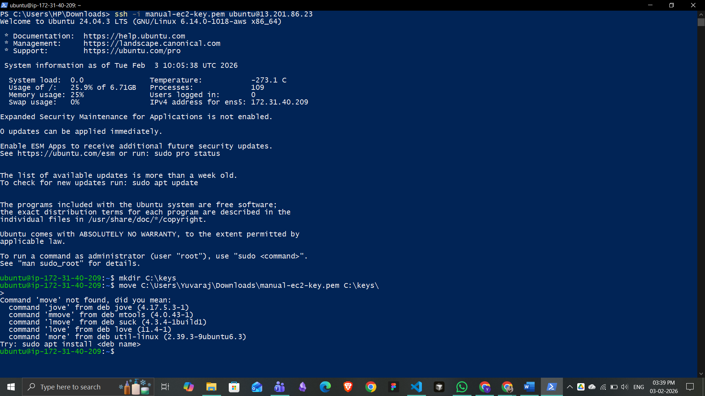
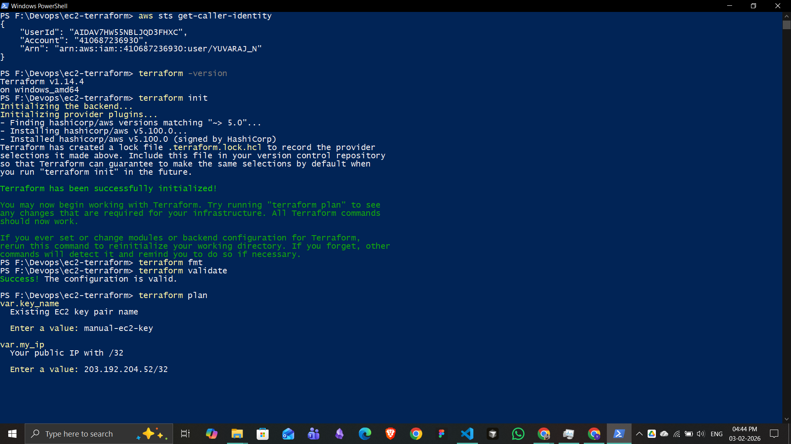
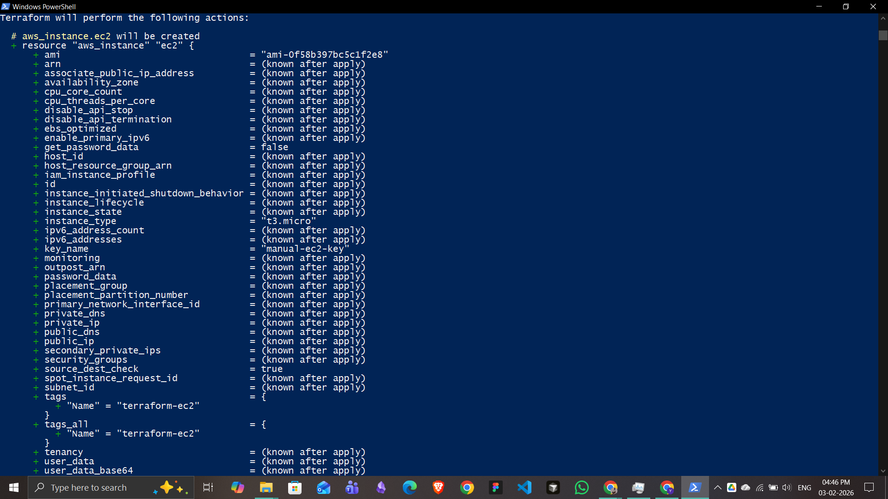
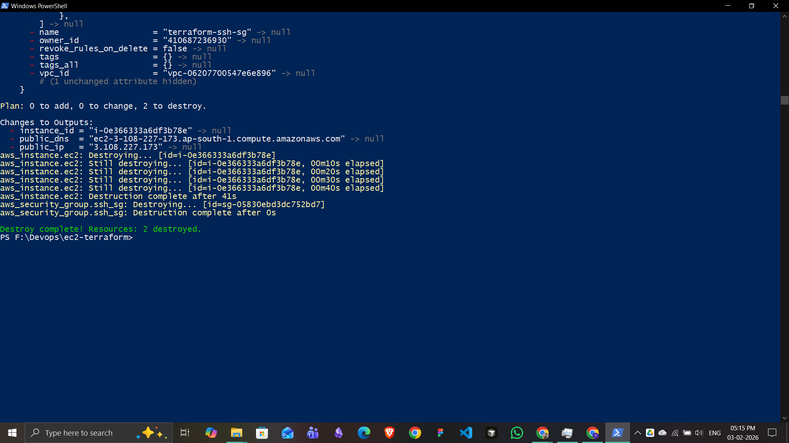

---

## 🚀 Part 1: Manual EC2 Creation (AWS Console)

**Steps followed:**
1. Logged in to AWS Console
2. Created an EC2 instance (Ubuntu 24.04 LTS)
3. Configured key pair and security group
4. Allowed SSH (port 22) from my IP
5. Connected to the instance using SSH

### 📸 Screenshot — Manual EC2 Instance

### 📸 Screenshot — SSH Login

---

## ⚙️ Part 2: EC2 Creation Using Terraform

**Steps followed:**
1. Installed Terraform and AWS CLI
2. Configured AWS CLI using IAM user credentials
3. Initialized Terraform
4. Planned and applied infrastructure
5. Verified EC2 creation
6. Connected to the instance via SSH
7. Destroyed resources to avoid AWS charges

---

## 🛠 Terraform Commands Used

- `terraform init`
- `terraform fmt`
- `terraform validate`
- `terraform plan`
- `terraform apply`
- `terraform destroy`

---

## 📸 Screenshots — Terraform

### Terraform Apply

### Terraform EC2 Instance

### Terraform Destroy

---

## 🔐 Security Best Practices Followed

- ❌ `.terraform/` directory not committed
- ❌ `terraform.tfstate` not committed
- ❌ `.pem` key files not uploaded
- ✅ `.gitignore` properly configured
- ✅ IAM user used instead of root account

---

## 🧹 Cleanup

All Terraform-managed resources were destroyed using:

`terraform destroy`

This ensures no AWS resources are left running and avoids unnecessary charges.

---

## 👤 Author

**Yuvaraj N**  
GitHub: https://github.com/1YUVARAJ1

---

## ⭐ Outcome

- ✔ Learned manual vs Terraform EC2 provisioning
- ✔ Practiced real-world DevOps workflow
- ✔ Followed clean GitHub & security best practices
